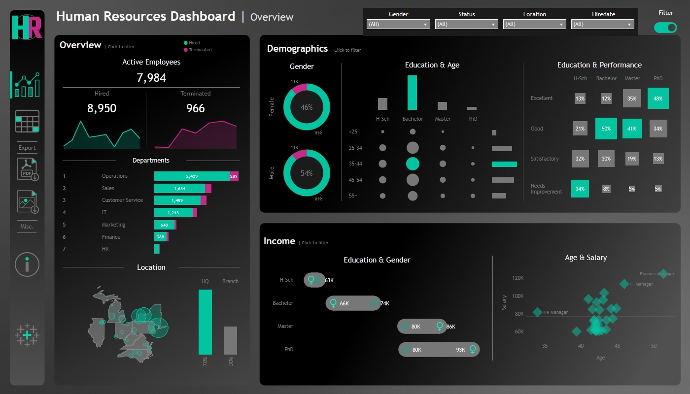
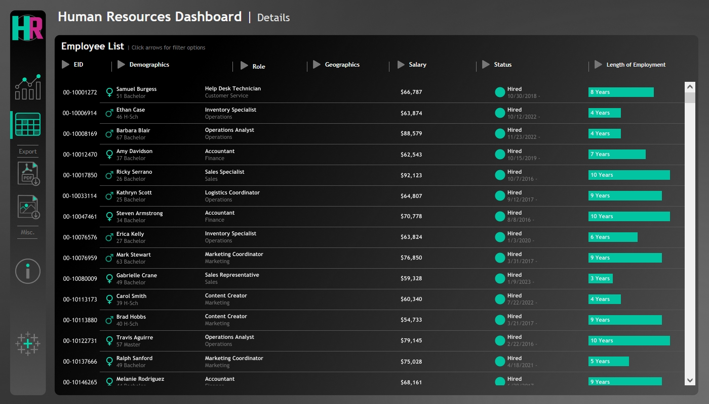

# HR Dashboard

A compact, interactive **HR Dashboard** providing insights into employee metrics across an organization. The dashboard offers a high-level overview of workforce trends and demographics.

---

## Overview

The dashboard includes:

- Total employees, hires, and terminations  
- Department-wise employee distribution  
- Location analysis (HQ vs. branch offices)  
- Demographics: age, gender, and other key attributes  
- Income and compensation trends  

All metrics are visualized for quick insights and easy comparison.

---

## Technology Stack

- **Dashboard:** Tableau
- **Data Processing:** Tableau built-in functions  

---

Also this project could be seen on Tableau Public [here](https://public.tableau.com/app/profile/andrzej.awr/viz/HRProjectCustom/HRSummary)
